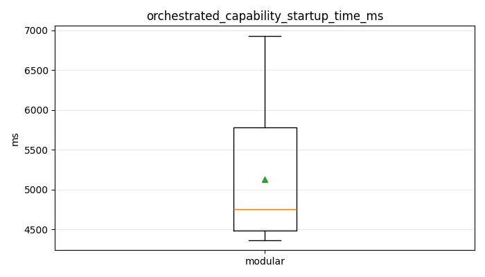
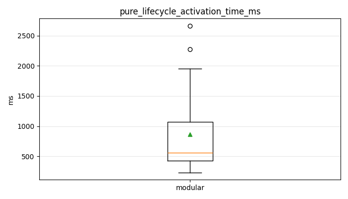
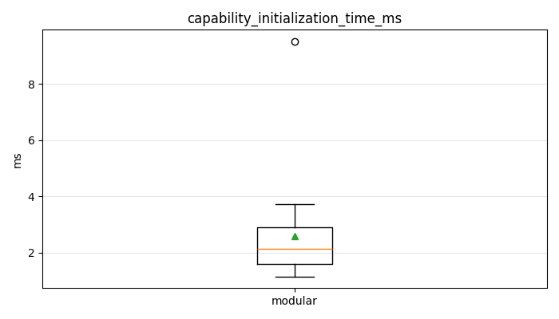
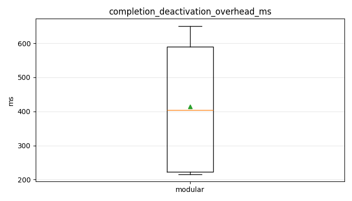
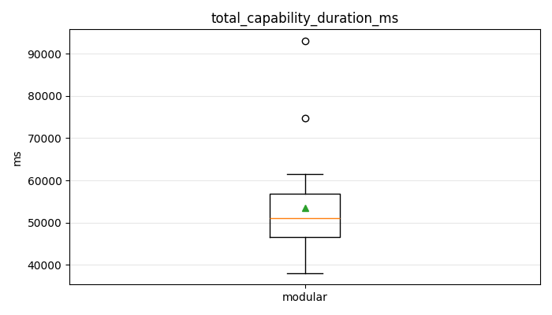

# Capability Runtime Overhead Report

## Experiment Configuration

- Architecture: `modular`
- Capability: `grab_bag`
- Requested runs: `5`
- Completed runs for this configuration: `10`
- Failure mode: `False`
- Resource monitoring: `True`
- Output directory: `/home/lab/cs4home_ws/src/cs4home_hri_challenge/cs4home_hri_challenge/data/hri_runtime_eval`

Timing metrics separate orchestration startup, pure lifecycle activation, capability initialization, functional capability execution, and completion/deactivation. Robot navigation, speech synthesis, perception, user waiting, and task-specific waiting are bracketed by the executable BT action markers and contribute only to `capability_execution_time_ms`.

Resource measurements report resource usage overhead for the selected architecture during each capability run; they are not timing metrics.

## Metric Definitions

- `orchestrated_capability_startup_time_ms`: experiment capability request to capability executable. In modular runs this includes master configure/activate, lifecycle client setup, service waits, module state lookup, and module activation until ACTIVE. In BT runs this is request to first tick entering the selected capability subtree.
- `pure_lifecycle_activation_time_ms`: modular-only interval from immediately before sending `ChangeState(TRANSITION_ACTIVATE)` to the selected module until the `lifecycle_activated` event is emitted. This excludes master startup and orchestration preparation.
- `capability_initialization_time_ms`: ACTIVE/executable boundary to first executable BT action.
- `capability_execution_time_ms`: first executable BT action to last executable BT action. This is functional robot behavior, not architectural overhead.
- `completion_deactivation_overhead_ms`: last executable BT action to completion/deactivation/control release.

## Metric Summary

| Architecture | Capability | Metric | N | Mean ms | Median ms | Stddev ms | Min ms | Max ms | 95% CI ms |
|---|---|---|---:|---:|---:|---:|---:|---:|---:|
| `modular` | `grab_bag` | `orchestrated_capability_startup_time_ms` | 10 | 5228.298 | 5095.966 | 795.878 | 4408.001 | 6528.625 | [4735.008, 5721.588] |
| `modular` | `grab_bag` | `pure_lifecycle_activation_time_ms` | 10 | 776.543 | 382.565 | 737.956 | 233.332 | 2272.014 | [319.153, 1233.933] |
| `modular` | `grab_bag` | `capability_initialization_time_ms` | 10 | 2.891 | 2.043 | 2.474 | 1.354 | 9.512 | [1.358, 4.425] |
| `modular` | `grab_bag` | `capability_execution_time_ms` | 10 | 53323.198 | 48204.369 | 14075.282 | 41481.138 | 86296.939 | [44599.248, 62047.148] |
| `modular` | `grab_bag` | `completion_deactivation_overhead_ms` | 10 | 222.117 | 221.127 | 5.068 | 215.815 | 231.378 | [218.976, 225.259] |
| `modular` | `grab_bag` | `total_capability_duration_ms` | 10 | 58776.505 | 53967.775 | 14495.482 | 46161.140 | 93051.759 | [49792.112, 67760.898] |
| `modular` | `grab_bag` | `experiment_total_duration_ms` | 10 | 60842.340 | 56023.257 | 14493.674 | 48262.291 | 95132.880 | [51859.068, 69825.612] |
| `modular` | `greeting` | `orchestrated_capability_startup_time_ms` | 10 | 5026.274 | 4731.606 | 884.130 | 4367.935 | 6927.229 | [4478.285, 5574.264] |
| `modular` | `greeting` | `pure_lifecycle_activation_time_ms` | 10 | 946.031 | 569.093 | 753.423 | 499.051 | 2661.788 | [479.055, 1413.008] |
| `modular` | `greeting` | `capability_initialization_time_ms` | 10 | 2.284 | 2.298 | 0.666 | 1.161 | 3.217 | [1.871, 2.697] |
| `modular` | `greeting` | `capability_execution_time_ms` | 10 | 42654.346 | 41826.077 | 7557.208 | 32651.232 | 54387.641 | [37970.339, 47338.352] |
| `modular` | `greeting` | `completion_deactivation_overhead_ms` | 10 | 605.843 | 592.978 | 29.779 | 575.482 | 650.423 | [587.386, 624.300] |
| `modular` | `greeting` | `total_capability_duration_ms` | 10 | 48288.746 | 47010.475 | 8118.001 | 38054.530 | 61432.744 | [43257.157, 53320.336] |
| `modular` | `greeting` | `experiment_total_duration_ms` | 10 | 50360.237 | 49052.627 | 8116.085 | 40153.392 | 63465.432 | [45329.836, 55390.639] |

## BT vs Modular Comparison

| Capability | Metric | BT mean ms | Modular mean ms | Modular - BT ms |
|---|---|---:|---:|---:|
| `grab_bag` | `orchestrated_capability_startup_time_ms` | nan | 5228.298 | nan |
| `grab_bag` | `pure_lifecycle_activation_time_ms` | nan | 776.543 | nan |
| `grab_bag` | `capability_initialization_time_ms` | nan | 2.891 | nan |
| `grab_bag` | `capability_execution_time_ms` | nan | 53323.198 | nan |
| `grab_bag` | `completion_deactivation_overhead_ms` | nan | 222.117 | nan |
| `grab_bag` | `total_capability_duration_ms` | nan | 58776.505 | nan |
| `grab_bag` | `experiment_total_duration_ms` | nan | 60842.340 | nan |
| `greeting` | `orchestrated_capability_startup_time_ms` | nan | 5026.274 | nan |
| `greeting` | `pure_lifecycle_activation_time_ms` | nan | 946.031 | nan |
| `greeting` | `capability_initialization_time_ms` | nan | 2.284 | nan |
| `greeting` | `capability_execution_time_ms` | nan | 42654.346 | nan |
| `greeting` | `completion_deactivation_overhead_ms` | nan | 605.843 | nan |
| `greeting` | `total_capability_duration_ms` | nan | 48288.746 | nan |
| `greeting` | `experiment_total_duration_ms` | nan | 50360.237 | nan |

## Resource Summary

| Architecture | Capability | Metric | N | Mean | Peak |
|---|---|---|---:|---:|---:|
| `bt` | `grab_bag` | `cpu_percent` | 10 | 11.685 | 74.528 |
| `bt` | `grab_bag` | `rss_mb` | 10 | 218.371 | 243.535 |
| `bt` | `grab_bag` | `thread_count` | 10 | 20.033 | 21.000 |
| `bt` | `grab_bag` | `ros2_process_count` | 10 | 1.982 | 2.000 |
| `bt` | `greeting` | `cpu_percent` | 10 | 8.192 | 45.733 |
| `bt` | `greeting` | `rss_mb` | 10 | 216.492 | 231.871 |
| `bt` | `greeting` | `thread_count` | 10 | 23.989 | 26.000 |
| `bt` | `greeting` | `ros2_process_count` | 10 | 1.978 | 2.000 |
| `modular` | `grab_bag` | `cpu_percent` | 10 | 18.433 | 86.747 |
| `modular` | `grab_bag` | `rss_mb` | 10 | 265.667 | 274.660 |
| `modular` | `grab_bag` | `thread_count` | 10 | 35.293 | 36.000 |
| `modular` | `grab_bag` | `ros2_process_count` | 10 | 4.000 | 4.000 |
| `modular` | `greeting` | `cpu_percent` | 10 | 9.815 | 48.436 |
| `modular` | `greeting` | `rss_mb` | 10 | 277.421 | 285.805 |
| `modular` | `greeting` | `thread_count` | 10 | 39.687 | 41.000 |
| `modular` | `greeting` | `ros2_process_count` | 10 | 4.000 | 4.000 |

## Plots

## Interpretation

Use `orchestrated_capability_startup_time_ms` for end-to-end capability startup from the experiment request to executability. Use `pure_lifecycle_activation_time_ms` for the isolated ROS 2 lifecycle activation service cost. Use `capability_initialization_time_ms` to quantify initialization after the module/subtree is executable but before behavior starts. Use `completion_deactivation_overhead_ms` for completion signaling and control release. Use `capability_execution_time_ms` only to compare equivalent functional robot behavior boundaries; it is not architectural overhead.
